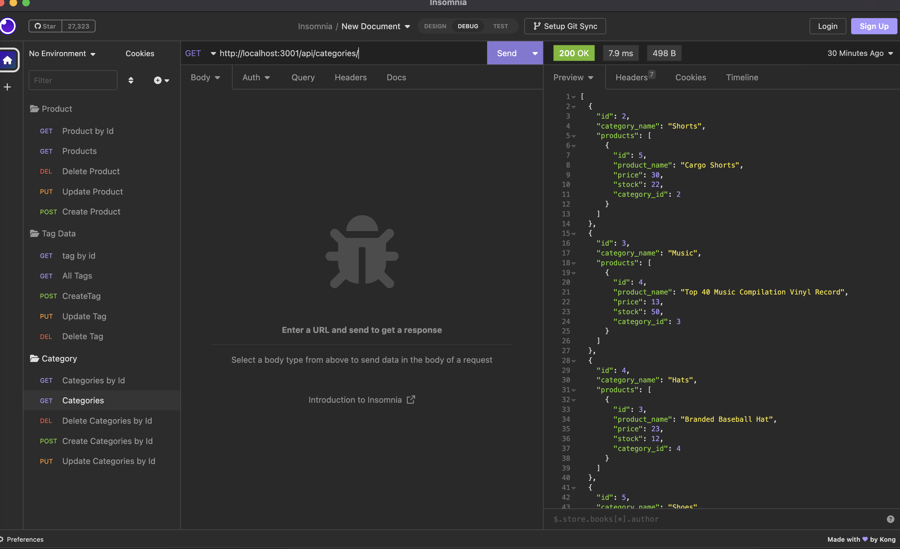

# E-commerce Back End Starter Code
# Module 13 Challenge

## Description

This project was built to run the backend of an eccomerce site.

## Table of Contents (Optional)

- [Installation](#installation)
- [Usage](#usage)
- [Features](#features)

## Installation

1. Go To https://github.com/andyabebaw/EcommModule13
2. Copy the Git clone link using SSH.
3. In terminal on your local device, clone the repository using Git clone.
4. Open in Visual Studio.

## Usage

This website can be used to add delete and update categories products and tags on an eccomerce site.

## Required Features

- Add new categories, tags and products
- Get categories, tags and products by id
- Delete new categories, tags and products
- Update new categories, tags and products

## How to Contribute

Follow the Installation Instructions above or click here: [Installation](#installation)
Make changes to index.html to add, remove, or change sections.  Edit the style.css to change the website appearance.  Also free to add new images in the images in images folder to be used on the site.
